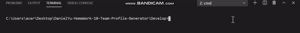
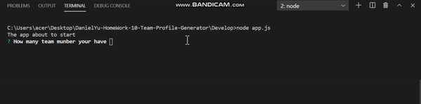
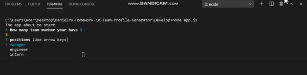
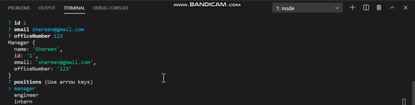
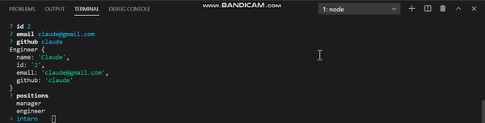
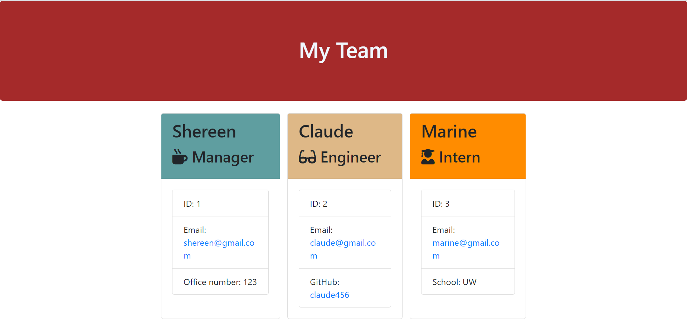

# Unit 10 OOP Homework: Template Engine - Employee Summary
[](https://opensource.org/licenses/MIT)


### Project Description
```md
* A sample Template Engine that can help the user quickly create a web page for employee summary
* The summary included employee name, position, id
* The different role will provide different information  on the last row (School, link to GitHub profile, or office number)
```


### Install
```md
* TERMINAL
* Change directory to `Develop` folder
* `npm i` (or `npm install`)
```


### Usage

1. `node app.js`



2. input the number of team member



3. input the member information

* Manager



* Engineer



* Intern



* Ouput



* Each role


- Make sure the email is correct


### Language
```md
* Javascrpit
* Node.js
```

### Test
```md
* TERMINAL
* Change directory to `Develop` folder
* `npm run test`
```


## About
* Project Github: https://github.com/DanielYu0864/DanielYu-HomeWork-10-Team-Profile-Generator
* Author: [`DanielYu0864`](https://github.com/DanielYu0864)

## Questions
*  For more question please contact me: adam741963@gmail.com
